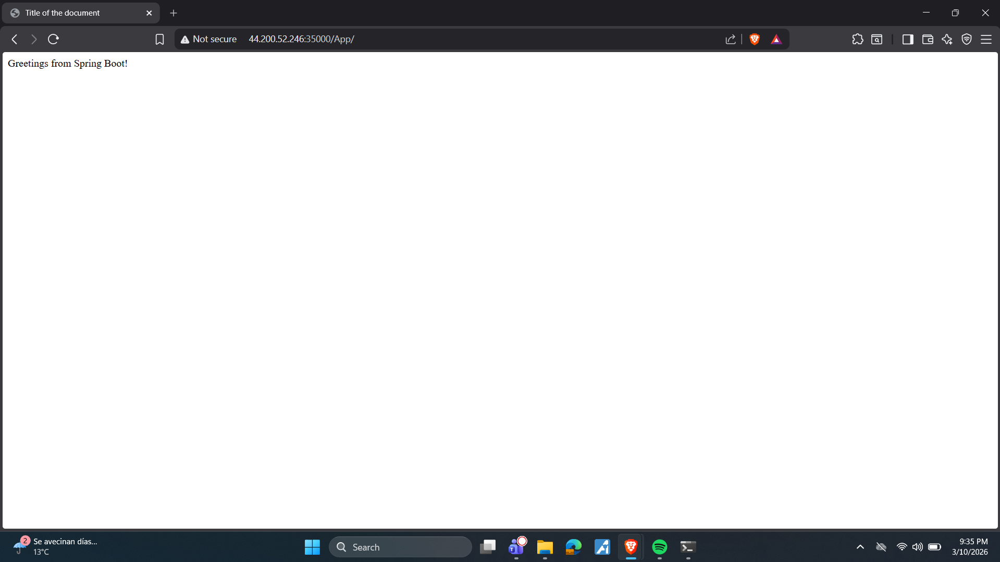
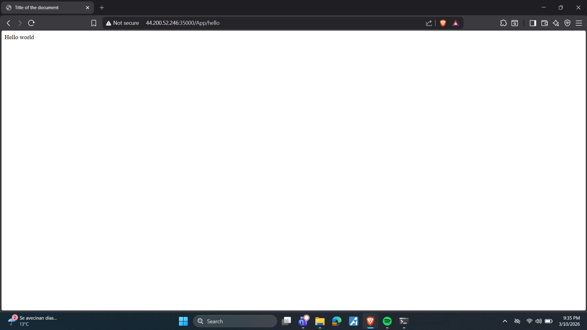
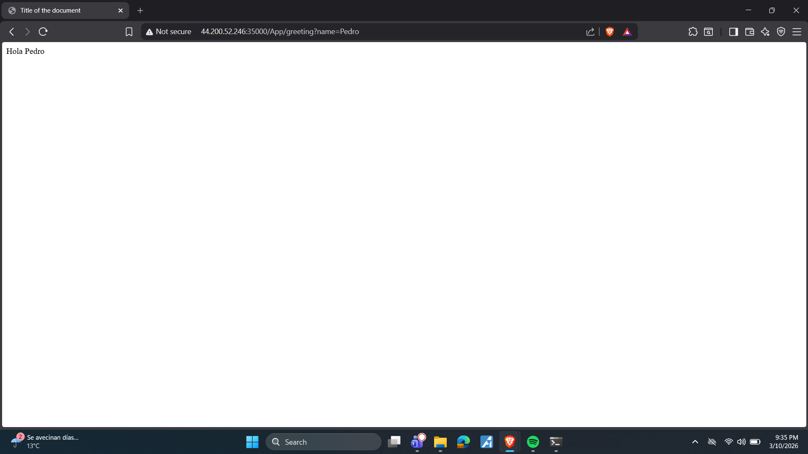

# MicroSpringBoot — Framework IoC con Reflexión en Java

Framework web minimalista desarrollado en Java que replica las capacidades básicas de Spring Boot usando reflexión. Permite construir aplicaciones web a partir de POJOs anotados, sin depender de ningún framework externo. Incluye un servidor HTTP propio sobre sockets TCP.

## Tabla de contenidos

- [Descripción](#descripción)
- [Arquitectura](#arquitectura)
- [Anotaciones disponibles](#anotaciones-disponibles)
- [Requisitos](#requisitos)
- [Instalación y ejecución](#instalación-y-ejecución)
- [Uso del framework](#uso-del-framework)
- [Despliegue en AWS](#despliegue-en-aws)
- [Evidencia de pruebas](#evidencia-de-pruebas)

---

## Descripción

MicroSpringBoot demuestra las capacidades reflexivas de Java para construir un contenedor IoC funcional. El framework escanea automáticamente el classpath en busca de clases anotadas con `@RestController`, registra sus métodos marcados con `@GetMapping` como endpoints HTTP, y los sirve a través de un servidor TCP propio en el puerto 35000.

---

## Arquitectura

```
src/main/java/edu/eci/MicroSpringBoot/
├── MicroSpringBootApplication.java  # Punto de entrada: escaneo por reflexión y arranque del servidor
├── HttpServer.java                  # Servidor HTTP sobre sockets TCP puros
├── HttpRequest.java                 # Parseo de query parameters de la URL
├── HttpResponse.java                # Objeto de respuesta (extensible)
├── WebMethod.java                   # Interfaz funcional para lambdas REST
├── GetMapping.java                  # Anotación para mapear rutas GET
├── RestController.java              # Anotación para marcar componentes web
├── RequestParam.java                # Anotación para extraer parámetros de la URL
├── HelloController.java             # Controlador de ejemplo con múltiples endpoints
└── GreetingController.java          # Controlador de ejemplo con @RequestParam
```

### Flujo de arranque

```
MicroSpringBootApplication.start()
        │
        ├── scanControllers()
        │       └── Escanea todas las .class del paquete
        │               └── Filtra las que tienen @RestController
        │
        ├── Por cada @RestController:
        │       └── Por cada método con @GetMapping:
        │               └── HttpServer.get("/App" + path, lambda con reflexión)
        │
        └── HttpServer.main() → escucha en puerto 35000
```

### Flujo de una petición

```
Cliente (browser)
      │
      ▼
HttpServer (puerto 35000)
      │
      ├── Parsea ruta y query string
      ├── Busca endpoint en endPoints (HashMap)
      │       │ Encontrado → invoca lambda → method.invoke() por reflexión
      │       └── No encontrado → busca archivo estático o 404
      └── Escribe respuesta HTTP al cliente
```

---

## Anotaciones disponibles

**`@RestController`** — Marca una clase POJO como componente web. El framework la detecta automáticamente al arrancar.

```java
@RestController
public class MiControlador { }
```

**`@GetMapping(path)`** — Registra un método como endpoint GET en la ruta indicada. El framework le agrega el prefijo `/App` automáticamente.

```java
@GetMapping("/saludo")
public String saludo() {
    return "Hola mundo";
}
```

**`@RequestParam(value, defaultValue)`** — Extrae un parámetro de la query string de la URL.

```java
@GetMapping("/greeting")
public String greeting(@RequestParam(value = "name", defaultValue = "World") String name) {
    return "Hola " + name;
}
```

---

## Requisitos

- Java 17 o superior
- Maven 3.8 o superior
- Git

---

## Instalación y ejecución

### 1. Clonar el repositorio

```bash
git clone https://github.com/IvanCamiloCubillos13/MicroSpringBoot.git
cd MicroSpringBoot
```

### 2. Compilar y ejecutar

```bash
mvn clean compile exec:java "-Dexec.mainClass=edu.eci.MicroSpringBoot.MicroSpringBootApplication"
```

Al arrancar verás en consola:

```
Iniciando MicroSpringBoot...
Componente encontrado: edu.eci.MicroSpringBoot.GreetingController
Componente encontrado: edu.eci.MicroSpringBoot.HelloController
Registrado endpoint: /App/greeting
Registrado endpoint: /App/
Registrado endpoint: /App/pi
Registrado endpoint: /App/hello
Listo para recibir ...
```

### 3. Endpoints disponibles

| Endpoint | URL |
|---|---|
| Raíz | `http://localhost:35000/App/` |
| Hello world | `http://localhost:35000/App/hello` |
| Valor de PI | `http://localhost:35000/App/pi` |
| Saludo con parámetro | `http://localhost:35000/App/greeting?name=Pedro` |

---

## Uso del framework

Para crear un nuevo componente web basta con anotar un POJO y el framework lo detectará automáticamente:

```java
@RestController
public class MiControlador {

    @GetMapping("/fecha")
    public String fecha() {
        return "Hoy es: " + java.time.LocalDate.now();
    }

    @GetMapping("/suma")
    public String suma(@RequestParam(value = "n", defaultValue = "0") String n) {
        int valor = Integer.parseInt(n);
        return "El doble es: " + (valor * 2);
    }
}
```

Sin ninguna configuración adicional, al arrancar el framework los endpoints quedan disponibles en `/App/fecha` y `/App/suma?n=5`.

---

## Despliegue en AWS

El proyecto fue desplegado en una instancia EC2 de Amazon Linux. Los pasos para replicarlo son:

### 1. Compilar localmente

```bash
mvn clean compile
jar cf app.jar -C target/classes .
```

### 2. Subir al EC2

```bash
scp -i "tu-clave.pem" app.jar ec2-user@<ip-publica>:~/
```

### 3. Ejecutar en el EC2

```bash
ssh -i "tu-clave.pem" ec2-user@<ip-publica>
java -cp app.jar edu.eci.MicroSpringBoot.MicroSpringBootApplication
```

### 4. Configurar Security Group

Agregar una regla de inbound en el Security Group de la instancia:

- Type: `Custom TCP`
- Port: `35000`
- Source: `0.0.0.0/0`

---

## Evidencia de pruebas

Todos los endpoints fueron probados desplegados en AWS EC2 (`44.200.52.246:35000`).

**`/App/` — Raíz del HelloController**



**`/App/hello` — Endpoint hello**



**`/App/pi` — Valor de PI**


**`/App/greeting?name=Pedro` — Endpoint con @RequestParam**



---

Autor: Ivan Cubillos
